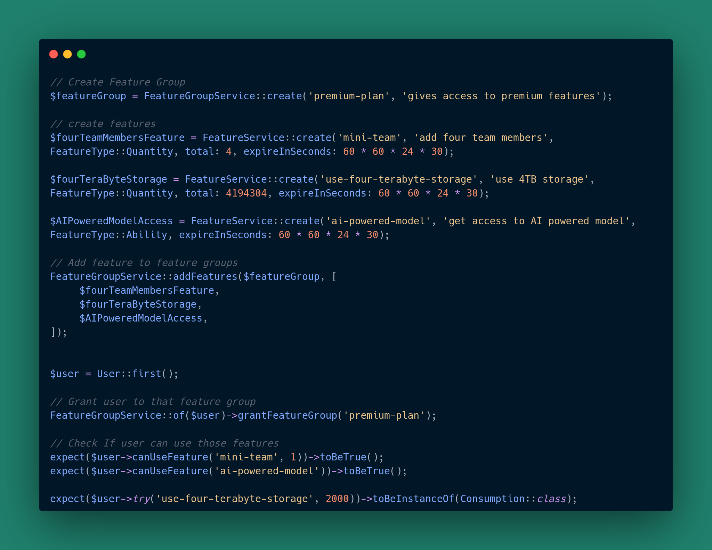

# Use-It - Features, Abilities, Usages and Consumptions



## Table Of Contents

- [Introduction](#introduction)
- [Concept](#concept)
- [Installation](#installation)
- [Usage](#usage)
- [Middleware](#middleware)
- [SoftDeletes](#softdeletes)
- [Custom Models](#using-custom-models)
- [Testing](#testing)
- [Bug Report](#bug-report)
- [License](#license)
- [Funding](#funding)

> `FeatureGroup` is introduced `v0.2.0`. It is similar to `Role` in `roles-permissions` concept. You can assign multiple `features` to the `feature-group` and then those features will be automatically attached to the user if user is given access to that `feature-group`. 

## Introduction

While there are many packages in Laravel like Laravel Pennant (for feature flags) and Spatie Permission (for managing
user permissions and roles), I would like to create a feature that is not only an ability or permission but also a consumable one. 

For example, I want to make an ability feature called "can-post" so users can create posts. Also, I'm thinking of a
consumable feature called "storage" for using storage in the app. I plan to have different levels of usage for "
storage," like "100GB storage" or "1TB storage."

## Concept

In this system, we have four main database models:

- Feature: This model handles the creation of features.
- Ability: It manages interactions with ability-based features.
- Usage: This model tracks the usage of quantity-based features.
- Consumption: Responsible for managing the consumption of a usage.
- FeatureGroup: Responsible for handling feature groups

When you create a new feature, you can grant a user access to that feature. Depending on the type of feature—whether
it's an ability or a usage—a corresponding ability or usage record will be generated. You can then test this ability or
usage by using the feature name.

## Installation

- ### Install via composer

```php
composer require thomas-brillion/use-it
```

- ### Setting up migrations

Publish the migration presets.

```bash
php artisan vendor:publish --tag=use-it-migrations
```

Note: If you are using `feature group` on different table other than `users`, please create a pivot table and change the table in the relationship such as 

```php
public function featureGroups(): BelongsToMany
{
   return $this->belongsToMany(ThomasBrillion\UseIt\Support\ModelResolver::getFeatureGroupModel(), 'your_pivot_table_name');
}
```

Please consult [laravel documentation](https://laravel.com/docs/11.x/eloquent-relationships#many-to-many) for more details. 


- ### Setting up your model

Implement either `ThomasBrillion\UseIt\Interfaces\CanUseFeature` or `ThomasBrillion\UseIt\Interfaces\CanUseFeatureGroup` interface in your model class and
either include `ThomasBrillion\UseIt\Traits\CanUseIt` trait or resolve the interface on your own.

> It is not mandatory to implement `ThomasBrillion\UseIt\Interfaces\CanUseFeatureGroup` interface if you don't want to use feature group.

```php

use ThomasBrillion\UseIt\Interfaces\CanUseFeature;

class User implements CanUseFeature {
   use CanUseIt;
   ...
}
```

## Usage


- ### Create Features

In order to create feature, you can use `create` method of `FeatureService` service.

There are two types of features: `Ability` and `Quantity`.

> Note: Feature name must be unique.

```php
ThomasBrillion\UseIt\Services\FeatureService::create(
   name: 'post',
   description: 'create a post',
   type: \ThomasBrillion\UseIt\Support\Enums\FeatureType::Ability,
   meta: [],
   disabled: false
)
```         

- ### Grant User to Feature

Use `grantFeature` method of `FeatureService`.

- If feature is `Ability` type, `Ability` record will be created for user.

```php
$user = User::first(); // or any eloquent model which either uses `CanUseIt` trait or implements `CanUseFeature` interface.

ThomasBrillion\UseIt\Services\FeatureService::of($user)->grantFeature('post', expireAt:  new DateTime('1year'))
```

- if feature is `Quantity` type, `Usage` record will be created. You need pass third parameter as `maximum_value` of
  feature, optionally fourth parameter as `level` and fifth parameter as `meta`.

```php
$user = User::first(); // or any eloquent model which either uses `CanUseIt` trait or implements `CanUseFeature` interface.

ThomasBrillion\UseIt\Services\FeatureService::create(
   name: 'storage',
   description: 'use storage',
   type: \ThomasBrillion\UseIt\Support\Enums\FeatureType::Quantity,
   meta: [],
   disabled: false
)
ThomasBrillion\UseIt\Services\FeatureService::of($user)->grantFeature(feature: 'storage', expireAt:  new DateTime('1year'), total: 100, level: 0)

// granting multiple features
ThomasBrillion\UseIt\Services\FeatureService::of($user)->grantFeatures(['storage','post'], expireAt:  new DateTime('1month'), total: 100, level: 0)
```  

> Note: You can create multiple usages of same feature with different maximum values and level. When usage is consumed,
> higher level usage will try to be consumed first.

- ### Checking if user can use feature

```php
$user = User::first(); // or any eloquent model which either uses `CanUseIt` trait or implements `CanUseFeature` interface.

$user->canUseFeature('post'); // return boolean

$user->canUseFeature(name:'storage', amount:1000);
```

- ### Consuming usable feature

Use `try` method of `FeatureService`. Pass `feature_name` as first parameter and `amount` as second parameter if feature
is quantitative type.

If feature is `Quantity` type, `Consumption` model object will be returned upon successful process. otherwise, following
errors will be thrown depending on the condition.

- `Cannot find usages for the feature` if feature is not found
- `Usage is expired` if user has expired access to the feature
- `Usage is out of limit` if user has consumed all available amount.

```php
$user = User::first(); // or any eloquent model which either uses `CanUseIt` trait or implements `CanUseFeature` interface.

$featureService = new ThomasBrillion\UseIt\Services\FeatureService($user);

ThomasBrillion\UseIt\Services\FeatureService::create(
   name: 'storage',
   description: 'create a post',
   type: \ThomasBrillion\UseIt\Support\Enums\FeatureType::Quantity,
)

ThomasBrillion\UseIt\Services\FeatureService::of($user)->grantFeature('storage',  expireAt: new DateTime('1year'), total: 1000 );

$user->try('storage', amount: 10);
```

- ### Disable/Enable Feature

You can toggle accessiblity to the feature.

```php
$user = User::first(); // or any eloquent model which either uses `CanUseIt` trait or implements `CanUseFeature` interface.

ThomasBrillion\UseIt\Services\FeatureService::create(
   name: 'storage',
   description: 'use storage',
   type: \ThomasBrillion\UseIt\Support\Enums\FeatureType::Quantity,
)

ThomasBrillion\UseIt\Services\FeatureService::disableFeature('storage');

ThomasBrillion\UseIt\Services\FeatureService::enableFeature('storage');
```

- ### Revoking access to feature

You can revoke access to feature using `revokeToFeature` method of `FeatureService` class.

```php
$user = User::first(); // or any eloquent model which either uses `CanUseIt` trait or implements `CanUseFeature` interface.

$featureService = new ThomasBrillion\UseIt\Services\FeatureService($user);

ThomasBrillion\UseIt\Services\FeatureService::create(
   name: 'post',
   description: 'create a post',
   type: \ThomasBrillion\UseIt\Support\Enums\FeatureType::Ability,
)

ThomasBrillion\UseIt\Services\FeatureService::of($user)->grantFeature('post', expireAt:  new DateTime('1month'));

$user->canUseFeature('post'); // true

ThomasBrillion\UseIt\Services\FeatureService::of($user)->revokeToFeature('post');
$user->canUseFeature('post'); // false
```

- ### Getting current usages of a feature

```php
$user = User::first(); // or any eloquent model which either uses `CanUseIt` trait or implements `CanUseFeature` interface.

$user->getConsumableUsagesOfFeature('post'); // return collection of usages
```

- ### Getting all usages of a feature

```php
$user = User::first(); // or any eloquent model which either uses `CanUseIt` trait or implements `CanUseFeature` interface.

$user->getAllUsagesOfFeature('post'); // return collection of usages
```

- ### Getting the current consumable usage of a feature

```php
$user = User::first(); // or any eloquent model which either uses `CanUseIt` trait or implements `CanUseFeature` interface.

$user->getCurrentUsageOfFeature('post');
```

- ### Getting consumptions of a feature

```php
$user = User::first(); // or any eloquent model which either uses `CanUseIt` trait or implements `CanUseFeature` interface.

$user->getConsumptionsOfFeature('post'); // return array of consumptions with key as usage id
```

- ## Feature Group

A feature group is a logical grouping of features, offering a centralized way to access and revoke features instead of interacting with a feature manually.

- Creating feature group
```php
$featureGroup = ThomasBrillion\UseIt\Models\FeatureGroup::create(
        'premium-plan',
        'gives access to premium features'
);
```

- Create new features or add existing features to feature group

I recommand you to set preset data for `Quantity` type feature such as `total` or `expireInSeconds`. 
```php
$fourTeamMembersFeature = FeatureService::create('mini-team', 'add four team members', FeatureType::Quantity, total: 4, expireInSeconds: 60 * 60 * 24 * 30);

FeatureGroupService::addFeatures($featureGroup, [
        $fourTeamMembersFeature,
        'can-post'
]);
```

- Grant user to that feature group.

```php
$user = User::first();

FeatureGroupService::of($user)->grantFeatureGroup('premium-plan');

expect($user->canUseFeature('mini-team', 1))->toBeTrue();
expect($user->canUseFeature('can-post'))->toBeTrue();
```

- Checking if user has feature group

```php
$user->hasFeatureGroup('premium-plan'); // return boolean.
```

- Revoke feature group

```php
FeatureGroupService::of($user)->revokeFeatureGroup('premium-plan');
```


- ## Middleware

In Laravel, `ThomasBrillion\UseIt\Http\Middlewares\CanUseFeatureMiddleware` is automatically registered in service
provider. You can use it in your route by using middleware alias `can-use-feature` by passing the feature name as first
parameter.

```php
Route::post('/post',[ExampleAction::class,'post'])->middleware('can-use-feature:post');
```

You can provide your auth guard as second parameter.

```php
Route::post('/post',[ExampleAction::class,'post'])->middleware('can-use-feature:post,student');
```

To check if user can consume usage of feature, you need to pass `amount` input in the request.

```text
https://example-laravel.test/post?amount=12
```

- ## Routing

Routes are disabled by default.
In order to enable it, you can either

- set the `routes` config as `true` or
- call this static
  method `\ThomasBrillion\UseIt\Http\Controllers\UseItController::routes();` inside your route file (
  eg `routes/web.php` )

There are two end-points provided by this package.

- Checking if user can use feature - `/use-it/can/{feature}`
  In order to check if the feature can be consumed a certain amount, pass query parameters - `amount` in the request.

    ```
    /use-it/can/post?amount=100
    ```

- Trying the feature - `/use-it/try/{feature}`
  In order to consume the feature, pass query parameters - `amount` and `meta` (optional) in the request.

    ```
    /use-it/try/post?amount=100
    ```

- ## SoftDeletes

In order to enable `SoftDelete` feature, you can [extend the models](#using-custom-models) and
follow [laravel soft-delete instructions](https://laravel.com/docs/11.x/eloquent#soft-deleting).

You also need to add `deleted_at` column in your migration. You can publish migrations using

```bash
php artisan vendor:publish --tag=use-it
```

- ## Using Custom Models

You can change `Feature`, `Ability`, `Usage` and `Consumption` models by either providing custom models in config file
or
registering it before using it.

Your custom model must implement corresponding interface.

- feature: `ThomasBrillion\UseIt\Interfaces\Models\FeatureInterface`
- featureGroup: `ThomasBrillion\UseIt\Interfaces\Models\FeatureGroupInterface`
- ability: `ThomasBrillion\UseIt\Interfaces\Models\AbilityInterface`
- usage: `ThomasBrillion\UseIt\Interfaces\Models\UsageInterface`
- consumption: `ThomasBrillion\UseIt\Interfaces\Models\ConsumptionInterface`

- #### Method A: Config File

```php
// configs/use-it.php
[
    'routes' => false,

    'models' => [
    
        // Change your custom model here
        'feature' => MyCustomFeatureModel::class,

        'feature-group' => \ThomasBrillion\UseIt\Models\FeatureGroup::class,

        'ability' => \ThomasBrillion\UseIt\Models\Ability::class,

        'usage' => \ThomasBrillion\UseIt\Models\Usage::class,

        'consumption' => \ThomasBrillion\UseIt\Models\Consumption::class,
    ]
];
```

- #### Method B: Manually Register Using Resolver

You can either register your custom model using `ThomasBrillion\UseIt\Support\ModelResolver`.

```php
use ThomasBrillion\UseIt\Support\ModelResolver;

ModelResolver::registerModel('feature', MyCustomFeature::class);
```

## Testing

`composer run test`

## Bug Report

Please kindly create an issue or pull request.

## License

The MIT LICENSE.

## Funding

Consider [buying me a coffee](https://buy.stripe.com/eVa4hXaHdc0t1Nu144) or informing me if you have any freelance projects or remote job opportunities available.

Please consider supporting me to continue contribution of open-source libraries.
